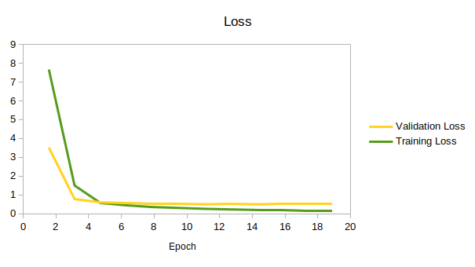
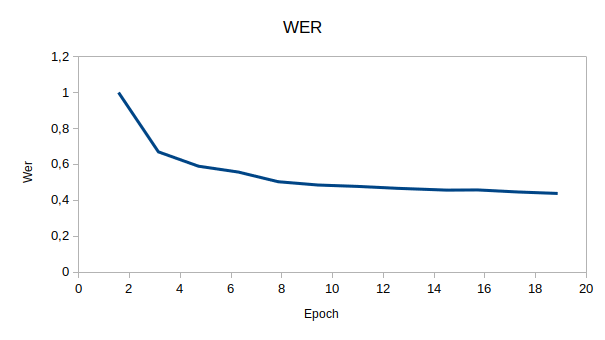

# Fongbe Speech Collection

<div align="center">

[](https://www.python.org/downloads/)
[](https://doi.org/10.5281/zenodo.6604637)

[2th place of Google NLP Hack Series](https://zindi.africa/competitions/google-asr-hack-series-africa-asr-data-challenge)

</div>


## Data

You must first download the dataset by following this [link](https://doi.org/10.5281/zenodo.6604637) and unzip the file by putting the **lab** and **wav** subfolders at the root of the dataset folder.


## Train a model

### Requirements

```sh
pip install -r requirements.txt
```

### Run training

To train a model with our collected data, run the following

```bash
python train.py
```

### Loss and WER obtained







## Citation
Cite as:
```bibtex
@dataset{laleye_frejus_a_a_2022_6604637,
  author       = {Laleye Fréjus A. A.},
  title        = {Fongbe speech dataset},
  month        = {jun},
  year         = {2022},
  publisher    = {Zenodo},
  version      = {1.0},
  doi          = {10.5281/zenodo.6604637},
  url          = {https://doi.org/10.5281/zenodo.6604637}
}
```